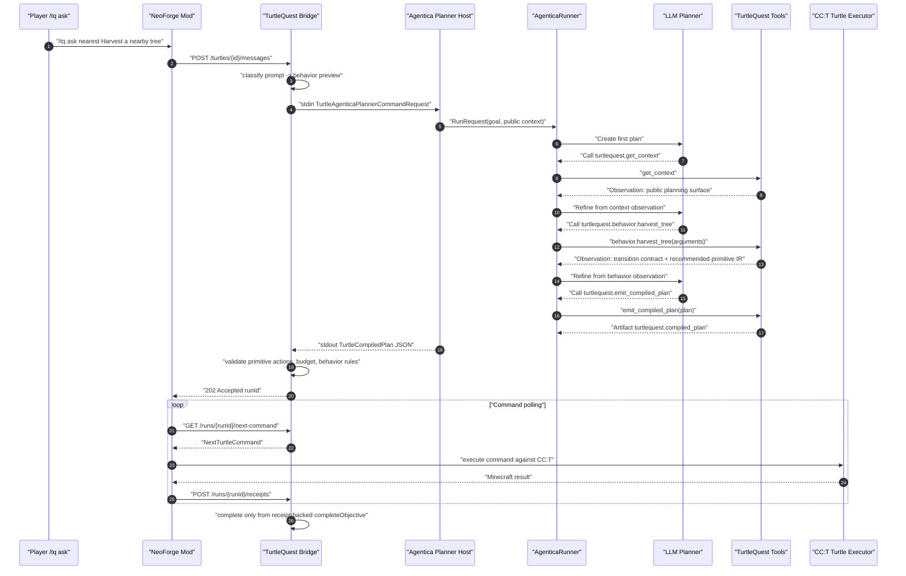
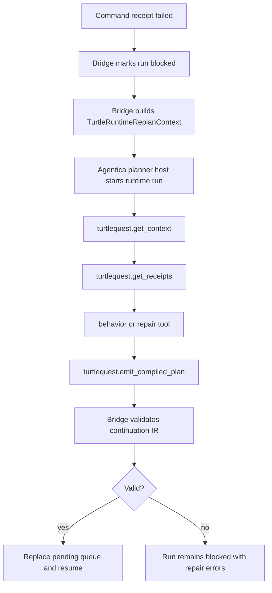

# Agentica To TurtleQuest IR Generation Flow

This is the expected flow for the current live planner host.



## Step Mapping

| Agentica step | Tool | Purpose | Output |
| --- | --- | --- | --- |
| 1 | `turtlequest.get_context` | Inspect the public TurtleQuest planning surface. | Observation with goal, behavior id, supported primitives, execution rules, and behavior tools. |
| 2 | `turtlequest.behavior.*` | Choose a durable host skill and inspect its transition contract. | Observation with recommended primitive steps and invariants. |
| 3 | `turtlequest.emit_compiled_plan` | Emit bridge-executable flattened IR. | `turtlequest.compiled_plan` artifact. |
| 4 | Bridge validation | Reject unsupported or unsafe IR. | Validated run queue or repairable errors. |
| 5 | Mod executor | Mutate Minecraft through CC:T commands. | Turtle command receipts. |

## Current Harvest Expectation

For:

```text
Harvest a nearby tree.
```

Agentica should produce a plan equivalent to:

```json
{
  "behaviorId": "turtlequest.harvest_tree",
  "steps": [
    { "action": "startBehavior" },
    { "action": "scanNearby" },
    { "action": "moveTowardRelative" },
    { "action": "digRememberedTarget" },
    { "action": "fellRememberedTree" },
    { "action": "getInventory" },
    { "action": "returnHome" },
    { "action": "emitStatus" },
    { "action": "completeObjective" }
  ]
}
```

The bridge should validate this as legal. The mod should then execute it against a real turtle and return receipts showing:

```text
tree scan
bounded approach
base log cut
vertical trunk felling
inventory evidence
breadcrumb return
completion artifact
```

## Runtime Replan Flow

Runtime replan is the same pattern with one extra evidence step.



Runtime continuation plans must omit `startBehavior` and must end with `completeObjective` for the current slice.

## Trace Expectations

Planner-host trace:

```text
run/traces/planner-host/<trace-id>/events.jsonl
```

Expected event sequence for initial planning:

```text
planner_host.started
agentica.event plan.created
agentica.event step.started tool=turtlequest.get_context
agentica.tool_result toolId=turtlequest.get_context
agentica.event step.started tool=turtlequest.behavior.harvest_tree
agentica.tool_result toolId=turtlequest.behavior.harvest_tree
agentica.event step.started tool=turtlequest.emit_compiled_plan
agentica.tool_result toolId=turtlequest.emit_compiled_plan
planner_host.final_plan
```

Expected event sequence for runtime replan:

```text
planner_host.started isRuntimeReplan=true
agentica.event step.started tool=turtlequest.get_context
agentica.tool_result toolId=turtlequest.get_context
agentica.event step.started tool=turtlequest.get_receipts
agentica.tool_result toolId=turtlequest.get_receipts
agentica.event step.started tool=turtlequest.behavior.<behavior>
agentica.tool_result toolId=turtlequest.behavior.<behavior>
agentica.event step.started tool=turtlequest.emit_compiled_plan
agentica.tool_result toolId=turtlequest.emit_compiled_plan
planner_host.final_plan
```

The planner host allows up to two read-only query steps in a batch so `get_context` and `get_receipts` can be planned together. Behavior tools and plan emission are still gated by receipt-backed session state.

Bridge run trace:

```text
run/traces/<runId>/events.jsonl
```

Expected event sequence after bridge accepts the plan:

```text
run.created_from_prompt_planner
run.next_command.dequeued
run.receipt_recorded
...
run.next_command.none
```

The planner-host trace proves the agent chose tools. The bridge run trace proves the Minecraft execution receipts.
